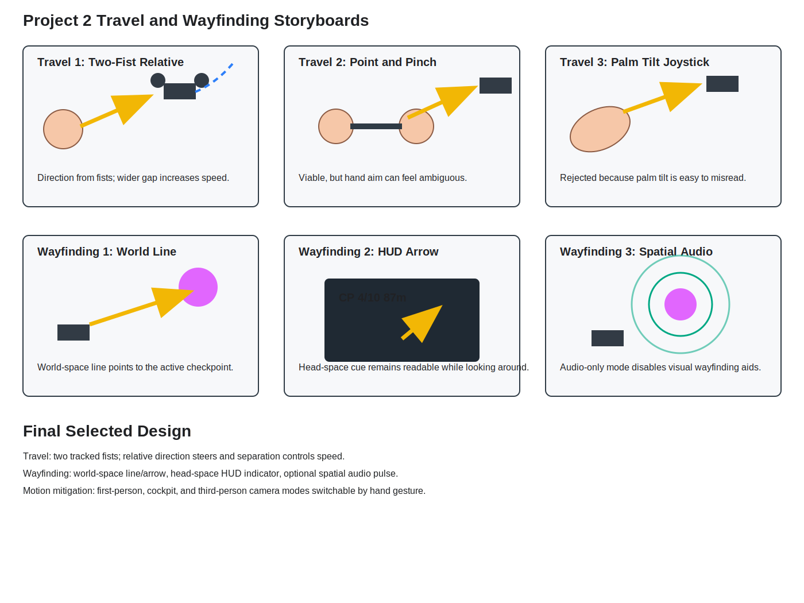

# CSE 165 Project 2 Design Document

## Project Summary

This project implements a Meta Quest hand-tracked drone navigation trainer at Machu Picchu. The operator flies through ordered checkpoints using hand tracking only, with visual and audio wayfinding, crash recovery, motion-sickness mitigation views, and extra-credit systems for audio-only waypoint navigation and ghost champion racing.

## Selected Interaction Design

The final travel technique uses a left-hand safety gate with right-hand speed modes. Both hands must be tracked, and opening the left hand stops the drone immediately. With the left hand closed as a fist, the vector from the left hand to the right hand becomes the flight direction. A right-hand fist gives variable speed based on hand separation; a right-hand flat/open pose gives a constant 70 m/s boost. The user can look around independently because head orientation is not used for steering.

The final wayfinding technique combines world-space aids and head-space aids. In normal mode, the user sees checkpoint spheres, a world line/arrow toward the next checkpoint, and HUD target distance/heading. In audio-only extra-credit mode, visual wayfinding is disabled except checkpoint display, and a spatialized pulse emits from the active waypoint.

## Travel Storyboards

### Travel 1: Two-Fist Relative Flight

The user closes the left hand into a fist as a safety gate. The right hand's position relative to the left hand controls direction: right hand left of the left hand moves left, right hand forward of the left hand moves forward, and vertical offsets climb or descend. A right fist gives variable speed from hand separation, while a right flat/open pose gives a constant 70 m/s boost. Opening the left hand stops immediately. This was selected because it satisfies the no-head-steering requirement and prevents drift when tracking is uncertain.

### Travel 2: Point-and-Pinch Flight

The user points the right hand toward the desired travel direction and pinches with the left hand to move. This was viable but rejected because it can become ambiguous if the hand aim pose feels coupled to where the user is looking.

### Travel 3: Palm Tilt Joystick

The user tilts one palm as an invisible joystick and pinches to confirm motion. This was viable but rejected because tilt can be ambiguous when the user turns their body or reaches around in VR.

## Wayfinding Storyboards

### Wayfinding 1: World-Space Checkpoint Line

A world-space line and arrow connect the drone to the next checkpoint. This was selected because it remains grounded in the environment and makes distant checkpoints visible.

### Wayfinding 2: Head-Space HUD Arrow

The HUD displays current checkpoint number, distance, and heading arrow. This was selected because it stays readable while the user looks around and uses a different coordinate system from the world-space line.

### Wayfinding 3: Spatial Audio Pulse

The active waypoint emits a spatialized pulse that gets louder and faster as the drone approaches. This was selected as extra credit and as an alternate wayfinding condition when visual aids are disabled.

## Heuristic Evaluation

| Heuristic | Violation and rationale | Severity | Recommendation |
| --- | --- | --- | --- |
| Visibility of system status | Mostly satisfied. Countdown, timer, speed, checkpoint index, status text, and view mode are visible. | 0 | Keep status messages short so they do not distract during racing. |
| Match between system and real world | Mostly satisfied. Two-handed steering and spatial waypoint audio map naturally to drone piloting and navigation. | 0 | In demo narration, explicitly describe the left fist as the anchor and the right fist as the direction handle. |
| User control and freedom | Mostly satisfied. User can stop by opening either hand, switch views, toggle audio-only mode, restart by holding both hands flat, and recover after crashes. | 0 | Keep the restart hold long enough to prevent accidental resets. |
| Consistency and standards | Mostly satisfied. Checkpoints use stable colors and ordered numbering; HUD uses conventional timer/speed displays. | 0 | Keep all demo terminology consistent: checkpoint, waypoint, race, crash reset. |
| Error prevention | Partially satisfied. No autopilot or collision avoidance is allowed, but crash recovery prevents unrecoverable states. | 1 | Keep visible checkpoint spheres enabled even in audio-only mode, as allowed by the writeup. |
| Recognition rather than recall | Mostly satisfied. HUD and world arrows reduce memory burden; status text names the active control and restart warning. | 1 | For final demo, show the gesture list briefly before headset footage. |
| Flexibility and efficiency of use | Satisfied. Editor keyboard fallback supports development only; Quest uses hand gestures for movement, view switching, restart, audio-only wayfinding, and ghost visibility. | 0 | Avoid relying on keyboard fallback in submitted demo. |
| Aesthetic and minimalist design | Mostly satisfied. HUD is compact and wayfinding aids are simple. | 0 | If visual clutter appears in video, use audio-only mode to demonstrate alternate navigation. |
| Help users recognize, diagnose, recover from errors | Mostly satisfied. Crash status and countdown make recovery obvious; invalid tracks log errors/warnings. | 1 | In demo, intentionally crash once to show recovery behavior. |
| Help and documentation | Partially satisfied. Implementation checklist and this document explain features. | 1 | Include the public GitHub URL and demo video URL in the final submission message. |

## Motion Sickness Observation

Pilot view without drone visuals is fastest and least visually cluttered, but it gives the fewest body-fixed cues. Cockpit view is the most stable because the cockpit frame stays visible while the user looks around. Third-person view makes the drone's motion easiest to understand, but it can feel less natural during tight turns because the camera follows behind the drone.

## Runtime Help

The HUD includes a controls panel under the timer, plus a race state panel on the right. After finishing, the HUD prompts the operator to hold both hands flat/open to reload the current XYZ track source and restart. During an active race, holding both hands flat/open for 10 seconds also restarts, with a visible warning during the last 5 seconds. Restarting resets the stopwatch to 0 and starts a 5-second countdown before controls are re-enabled.

## Implementation Checklist

The implementation checklist is maintained in `IMPLEMENTATION_CHECKLIST.md`. It maps the assignment requirements to code features and identifies selected extra-credit features.

## Submission Links

- Public GitHub repository: https://github.com/halvis82/project2_cse165
- Built APK artifact, local workspace: `Builds/Project2Race.apk`
- Demo video: record and attach/upload before final submission.
